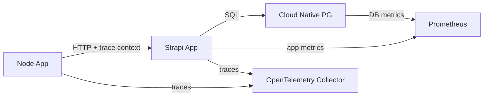

# Strapi and Cloud Native PG on Kubernetes with Observability

This project demonstrates a full-stack application with Strapi CMS, PostgreSQL database managed by Cloud Native PG Operator, and comprehensive observability using OpenTelemetry and Prometheus.

Strapi is a Content Management System (CMS) that provides flexibility to create custom services, controllers, policies, and more. When deploying this application in a distributed environment such as Kubernetes, adding observability helps with error detection and performance analysis.

This demo illustrates three approaches to improve Strapi observability:

- **Strapi Prometheus plugin to expose metrics** — useful for HTTP request, error, and resource metrics without custom code
- **Collection of logs, metrics, and traces based on the OpenTelemetry framework** — needed for distributed traces and request context propagation in custom controllers or other components
- **Prometheus metrics for Cloud Native PG, a PostgreSQL operator for Kubernetes** — lets you correlate database health and latency with Strapi behavior. Because Strapi connects to a SQL database, adding observability to the database helps surface issues that affect Strapi.

## Applications for the demo



**node-app** — Frontend web server that serves views and initializes distributed traces for user requests. It routes requests to Strapi and propagates trace context through the system using OpenTelemetry.

**strapi-app** — Strapi CMS instance that handles API requests, database operations, and exposes Prometheus metrics. It instruments API calls with OpenTelemetry spans for distributed tracing.

**PostgreSQL (Cloud Native PG)** — Primary database. Locally, a standalone PostgreSQL operator. In Kubernetes, deployed and managed by the Cloud Native PG Operator for high availability and automated backups.

**OpenTelemetry Collector** — Receives telemetry from instrumented services, processes traces and metrics, and forwards them to backends like Jaeger and Prometheus.

**Prometheus Operator** — Manages Prometheus instances and service discovery in Kubernetes, making it easier to deploy and configure monitoring for Strapi, PostgreSQL, and the observability stack.

## Prometheus metrics for Strapi

### Configuration

Exposing Prometheus metrics often requires adding instrumentation to apps or using exporters. The [Strapi Prometheus plugin](https://market.strapi.io/plugins/strapi-prometheus) provides a simple way to configure a comprehensive range of metrics.

`strapi-app` has an example of specific configuration in [`strapi-app/config/plugins.js`](strapi-app/config/plugins.js).

When launching Strapi locally, metrics are visible in `http://localhost:9000/metrics`:


## OpenTelemetry

### Manual instrumentation

To inject trace context into headers when fetching services (example in `node-app/index.js`):

```js
const { trace, context, propagation } = require('@opentelemetry/api');
const tracer = trace.getTracer('<service-name>'));
tracer.startActiveSpan('<span-name>', (span) => {
  let headers = {};
  // Inject current trace context into headers
  propagation.inject(context.active(), headers);

  fetch('<url>', { headers }).finally(() => {
    span.end();
  });
});
```

To extract context and correlate spans in the receiving service in a Strapi controller, use `propagation.extract` and `context.with` (example in `strapi-app/src/api/post/controllers/post.js`):

```js
const { trace, context, propagation } = require('@opentelemetry/api');
const tracer = trace.getTracer('strapi-otel-tracer');

// Inside controller

const headers = ctx.request.headers;
const parentContext = propagation.extract(context.active(), headers);

await context.with(parentContext, async () => {
  await tracer.startActiveSpan(
    '<span_name>',
    async (span) => {
      // execute instrumented code
      span.end();
    };
  );
});
```

## Kubernetes

### Deployment

`node-app` and `strapi-app` images are built with Docker and are required to be stored in a container registry. Image credentials for the `node-demo-app` and `strapi-demo-app` deployments must align with your container registry's visibility, access, and repository name.

The directory `kubernetes-manifests/secret-samples` provides examples of how to configure secrets.

Object deployments should be in this order:

1. Deploy cnpg-cluster objects:

```bash
kubectl apply -f kubernetes-manifests/cloud-native-pg
```

2. Deploy strapi-app objects:

```bash
kubectl apply -f kubernetes-manifests/strapi-app/configmap.yaml
kubectl apply -f kubernetes-manifests/strapi-app/persistent-volume-claim.yaml
kubectl apply -f kubernetes-manifests/strapi-app/deployment.yaml
kubectl apply -f kubernetes-manifests/strapi-app/service.yaml
```

3. Deploy node-app objects:

```bash
kubectl apply -f kubernetes-manifests/node-app/configmap.yaml \
kubectl apply -f kubernetes-manifests/node-app/deployment.yaml \
kubectl apply -f kubernetes-manifests/node-app/service.yaml
```

4. Deploy Opentelemetry Collector. For illustrative purposes, we have selected the [Jaeger V2 Operator](https://github.com/jaegertracing/jaeger-operator?tab=readme-ov-file) based on an OpenTelemetry Collector as it already provides a dashboard to inspect traces. It is recommended to explore other OpenTelemetry Collector images and dashboarding alternatives for production setups:

```bash
kubectl apply -f kubernetes-manifests/opentelemetry/custom-resource-definition.yaml
kubectl apply -f kubernetes-manifests/opentelemetry/opentelemetry-collector.yaml
```

5. Deploy the [kube-prometheus-stack Helm chart](https://github.com/prometheus-community/helm-charts/tree/main/charts/kube-prometheus-stack). If there is already a Prometheus operator in a different namespace, it is not necessary to install the chart again. Also, consider installing the Prometheus operator in a different namespace if it will be used for other namespaces:

```bash
helm repo add prometheus-community https://prometheus-community.github.io/helm-charts
helm repo update
```

```bash
helm install prometheus-stack prometheus-community/kube-prometheus-stack \
  -n observability-demo \
  -f kubernetes-manifests/kube-prometheus-stack/values.yaml
```

### Inspecting traces and metrics

Metrics for strapi-app-demo and cnpg-demo-cluster are available on the Prometheus server:

```bash
kubectl port-forward -n observability-demo \
  svc/kube-prometheus-stack-prometheus 9090:9090 \
```

Querying `up` metrics for the namespace `observability-demo` shows `cnpg-cluster-demo-1` and `strapi-app-demo`:

    up{service="strapi-app-service-demo" namespace="observability-demo"}


Inspect query latencies with queries such as:

    histogram_quantile(0.90, sum by(le) (rate(http_request_duration_seconds_bucket{app="strapi-app-service-demo" namespace="observability-demo"}[5m])))

Before launching the Jaeger dashboard, port-forward the node-app-demo and visit an instrumented route (`http://localhost:3000/grouped-posts-by-category`) to collect traces:

```bash
kubectl port-forward deploy/node-app-demo 3000:3000 -n observability-demo
```

Then, launch the Jaeger dashboard:

```bash
kubectl port-forward deployment/open-telemetry-instance-demo-collector 8080:16686 -n observability-demo
```


Traces can also be debugged through the collector logs while the `debug` exporter is active.

## Local deployment

Before starting services, ensure:

- PostgreSQL is running locally on port 5432
- Jaeger and observability stack are up
- `.env` files are configured for each app

### Jaeger

Launching Jaeger to collect traces:

    docker run --rm --name jaeger \
    -p 16686:16686 \
    -p 4317:4317 \
    -p 4318:4318 \
    -p 5778:5778 \
    -p 9411:9411 \
    cr.jaegertracing.io/jaegertracing/jaeger:2.15.0

Open Jaeger UI at `http://localhost:16686`.


Inspecting a trace:


### Strapi

Launch Strapi to serve the PostgreSQL database through a CMS:

    cd strapi-app
    npm run build
    npm run start

Access Strapi at `http://localhost:1337`. On first access:

1. Create an admin user
2. Enable `public` role permissions for `categories` and `posts` entities
3. Use the Content Manager to create categories and posts, then link them via relations

### node app

Launch the Node.js frontend application:

    cd node-app
    node index.js --env-file=.env

Open the app at `http://localhost:3000`. Visit the homepage and navigate to `/grouped-posts-by-category` to see grouped posts rendered with tracing enabled.

## Resources

- [OpenTelemetry JS Propagation](https://uptrace.dev/get/opentelemetry-js/propagation)
- [Node.js Distributed Tracing for Microservices](https://oneuptime.com/blog/post/2026-01-06-nodejs-distributed-tracing-microservices/view)
- [OpenTelemetry Spans Explained: Deconstructing Distributed Tracing](https://last9.io/blog/opentelemetry-spans-events/)
- [Jaeger V2 Operator](https://github.com/jaegertracing/jaeger-operator?tab=readme-ov-file)
- [kube-prometheus-stack Helm chart](https://github.com/prometheus-community/helm-charts/tree/main/charts/kube-prometheus-stack)
